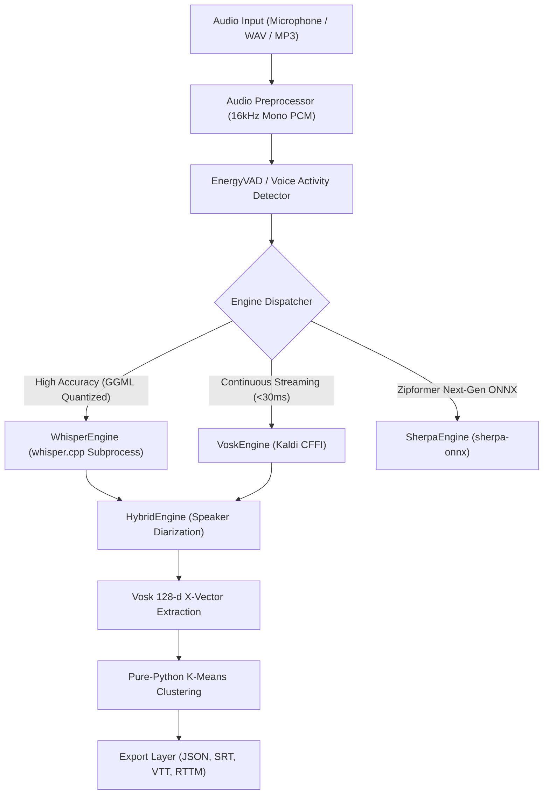

# Termux-STT: Enterprise On-Device Speech-to-Text & Speaker Diarization

[](https://pypi.org/project/termux-stt/)
[](https://pypi.org/project/termux-stt/)
[](https://www.npmjs.com/package/termux-stt)
[](https://github.com/uno-km/termux-stt)
[](https://www.vulkan.org/)

> **Termux-STT** is an industrial-grade, zero-compilation on-device Speech-to-Text (STT) and multi-speaker diarization framework engineered specifically for Android Termux, ARM64 mobile hardware, and edge environments. By orchestrating a Tri-Engine acoustic pipeline (**Whisper.cpp**, **Vosk/Kaldi**, and **Sherpa-ONNX Zipformer**) with pure-Python x-vector speaker clustering and direct Vulkan GPU acceleration, Termux-STT achieves sub-realtime transcription speeds (up to **10x faster than real-time**, RTF **0.102x**) and continuous offline listening with zero cloud telemetry.

---

## 1. Installation Guide

Termux-STT is distributed across both Python (PyPI) and Node.js (npm) ecosystems. It runs in unprivileged user-space on Android Termux (ARM64) and Linux aarch64/x86_64.

### 1.1 Prerequisites on Android Termux
Update package repositories and install the foundational audio and build utilities:
```bash
pkg update -y
pkg install -y clang python python-numpy nodejs termux-api ffmpeg pulseaudio
```

### 1.2 Pure Package Installation (Zero-Compilation Bundled Binary)
Install the core package from PyPI via `pip`:
```bash
pip install --upgrade pip
pip install termux-stt
```

> [!NOTE]
> **Bundled ARM64 Binary Architecture**: The official Python universal wheel (`termux_stt-*.whl`) directly bundles a pre-compiled Android ARM64 (Bionic libc) `whisper-cli` ELF executable inside `termux_stt/bin/whisper-cli`. When installed via `pip`, this binary is automatically unpacked into Python `site-packages`. Pure 16kHz WAV transcription is functional immediately without requiring any local C/C++ compiler toolchain.

To install with development extras:
```bash
pip install "termux-stt[dev]"
```

### 1.3 Node.js / TypeScript SDK & CLI Installation
Install globally or locally via `npm`:
```bash
# Global CLI installation (bridges to underlying Python runtime)
npm install -g termux-stt

# Project dependency installation
npm install termux-stt
```

### 1.4 Post-Installation Automated Environment Provisioner (`termux-stt install`)
While pure package installation provides instant offline WAV inference, production deployments involving compressed media (MP3/M4A/FLAC), live microphone streaming, or mobile GPU acceleration require full environment provisioning. Run the automated 1-click provisioner:

```bash
termux-stt-install
# Or equivalently:
termux-stt install
```

The automated engine installer (`EngineInstaller`) executes a 3-stage provisioning pipeline:
1. **Native System Dependencies (`install_system_dependencies`)**:
   Automatically invokes Termux `pkg` to install `ffmpeg`, `libbluray`, `libxml2`, `git`, `termux-api`, and `curl`, enabling universal audio decoding and microphone capture via Android APIs.
2. **Adaptive Engine Binary Provisioning (`install_whisper_cpp`)**:
   - **⚡ Fast-Track Stream Extractor (~3s)**: On Android ARM64 Termux, precompiled Vulkan+NEON Bionic binaries (`whisper-cli-android-arm64.tar.gz`) are automatically extracted from GitHub Releases in ~3 seconds, completely eliminating 20-minute on-device compilation and mobile OOM aborts.
   - **🛡️ Zero-Hardcoding SSOT Endpoints**: Binary downloads dynamically route through unified SSOT candidate endpoints (`TERMUX_STT_RELEASE_TAG` -> `v{__version__}` -> `releases/latest/download` -> `uno-km/ameva-runtime` releases fallback) with automated fallback to on-device C++ compilation (`cmake` + `clang`) in offline or air-gapped environments.
   - **📦 Bundled Package Binary Fallback**: Automatically discovers and links bundled `termux_stt/bin/whisper-cli` if present.
3. **Sub-Engine Ecosystem Provisioning (`install_vosk`, `install_sherpa_onnx`)**:
   Provisions `vosk` for sub-30ms real-time streaming and `sherpa-onnx` for next-generation ONNX Zipformer models, while pre-initializing model cache structures in `~/.cache/termux-stt/models/`.

### 1.5 Pure Install vs. Post-Install Comparison Matrix

| Feature / Capability | Pure Install (`pip install termux-stt`) | Post-Install (`termux-stt install`) |
| :--- | :--- | :--- |
| **Native Binary State** | Bundled CPU-NEON static binary (`site-packages/termux_stt/bin/`) | Dynamic: Local Vulkan GPU compilation or updated ARM64 release |
| **GPU Acceleration** | Hardware binding attempted via ameva-runtime | Fully compiled with native SPIR-V Vulkan shaders (`-DGGML_VULKAN=ON`) |
| **Supported Audio Formats** | Uncompressed WAV (16kHz PCM) | Universal: MP3, M4A, AAC, FLAC, OGG, WAV (via system `ffmpeg`) |
| **Live Microphone Stream** | Requires manual `termux-api` installation | Automated `termux-api` package provisioning |
| **Streaming Engine (Vosk)** | Skipped (Whisper-only mode) | Automated `vosk` pip package & model cache configuration |
| **Zipformer (Sherpa-ONNX)** | Skipped | Automated `sherpa-onnx` pip package & model cache configuration |
| **Setup Time** | Instantaneous (~3–5 seconds) | ~1–3 minutes (depending on whether local compilation occurs) |
| **Recommended Use Case** | Quick smoke testing, batch WAV inference | Production services, 24/7 background daemons, mobile GPU offloading |

---

## 2. GPU Hardware Acceleration Provisioning (`ameva-runtime`)

To unlock mobile GPU tensor compute via Vulkan SPIR-V compute pipelines on Qualcomm Adreno or ARM Mali silicon, pair `termux-stt` with the unified `@ameva/runtime` hardware acceleration layer.

### 2.1 Unified Installation Command
Install both the STT engine and the hardware acceleration runtime simultaneously:

```bash
# Python Environment
pip install termux-stt ameva-runtime

# Node.js / JavaScript Environment
npm install -g termux-stt @ameva/runtime
```

### 2.2 Hardware Diagnostics & Zero-Silent-Fallback Guarantee
Verify Vulkan driver detection and SIMD feature availability:
```bash
termux-stt doctor
```

Termux-STT strictly enforces a **Zero-Silent-Fallback Protocol**:
- When `--device vulkan` or `--device gpu` is requested and `ameva-runtime` is not installed, the engine immediately halts with `[ERROR: AMEVA-STT-E001]` rather than silently degrading to CPU execution.
- If no compatible Vulkan driver (`/system/lib64/libvulkan.so`) is found, the engine halts with `[ERROR: AMEVA-STT-E002]`, preventing unexpected battery drain and thermal throttling.

---

## 3. Basic Usage Guide

Termux-STT provides intuitive interfaces across CLI, Python, and Node.js.

### 3.1 Command-Line Interface (CLI)

```bash
# 1. Transcribe Audio File with Whisper (WAV, MP3, M4A, FLAC)
termux-stt transcribe meeting.wav -e whisper -m base -l en

# 2. Transcribe and Export to Timestamped Subtitles (SRT / VTT / JSON)
termux-stt transcribe interview.mp3 --format srt -o output.srt

# 3. Multi-Speaker Diarization (Who Spoke When)
termux-stt diarize discussion.wav --speakers 2 --format rttm -o speakers.rttm

# 4. Live Microphone Real-Time Listening (Termux-API)
termux-stt listen -e vosk -m small-ko

# 5. Run Built-in Benchmark with Verification Sample
termux-stt demo
```

### 3.2 Python SDK
```python
import termux_stt

# 1. Initialize High-Accuracy Whisper Engine with Auto Hardware Routing
engine = termux_stt.create_engine("whisper", model="base", device="auto")

# 2. Transcribe Audio File
result = engine.transcribe("meeting.wav")
print(f"Full Text: {result.text}")
for segment in result.segments:
    print(f"[{segment.start_sec:.2f}s -> {segment.end_sec:.2f}s] {segment.text}")

# 3. Instant Streaming with Vosk Engine (<30ms Latency)
vosk_engine = termux_stt.create_engine("vosk", model="small-ko")
vosk_result = vosk_engine.transcribe("quick_voice.wav")
print(f"Vosk Output: {vosk_result.text}")
```

### 3.3 Node.js / TypeScript SDK
```typescript
import { createEngine } from 'termux-stt';

async function main() {
  const engine = createEngine('whisper', {
    model: 'base',
    device: 'auto'
  });

  const result = await engine.transcribe('sample.wav');
  console.log('Transcription:', result.text);
  console.log(`Elapsed Time: ${result.elapsedMs}ms | RTF: ${result.rtf}x`);
}

main().catch(console.error);
```

---

## 4. Advanced Usage & Architecture

Termux-STT features a versatile Tri-Engine architecture designed to adapt dynamically between studio precision and low-latency continuous listening.



### 4.1 Subprocess Process Isolation & Mobile Crash Protection
Android Termux environments are prone to out-of-memory kernel kills (OOM) and SIGSEGV segmentation faults during heavy native C++ tensor inference. Termux-STT wraps `whisper.cpp` and `sherpa-onnx` in isolated process pools (`ProcessPool`), intercepting crashes gracefully without aborting the host Python application.

### 4.2 Multi-Speaker Diarization Pipeline (No Scikit-Learn Needed)
Traditional speaker diarization requires heavy machine learning frameworks (`scikit-learn`, `torchaudio`). Termux-STT integrates an ultra-lightweight **HybridEngine**:
1. Extracts 128-dimensional acoustic x-vector embeddings using Vosk.
2. Evaluates spatial clustering via an in-house pure-Python K-Means implementation with zero external dependencies.
3. Time-aligns speaker identities with Whisper transcript segments.

```python
import termux_stt

engine = termux_stt.create_engine("hybrid", whisper_model="base", num_speakers=2)
result = engine.transcribe("board_meeting.wav", diarize=True)

for seg in result.segments:
    print(f"[{seg.speaker_id}] {seg.start_sec:.1f}s - {seg.end_sec:.1f}s: {seg.text}")
```

### 4.3 Real-Time Live Microphone Streaming with VAD
Capture live audio directly from Android hardware microphones via Termux-API:
```python
import termux_stt

def on_partial_speech(text):
    print(f"Live Stream: {text}", end="\r", flush=True)

engine = termux_stt.create_engine("vosk", model="small-ko")
# Listen continuously with Voice Activity Detection
engine.listen(callback=on_partial_speech, sample_rate=16000)
```

---

## 5. Feature & Parameter Matrix

### 5.1 CLI Subcommands Overview

| Subcommand | Description | Example |
| :--- | :--- | :--- |
| `transcribe` | Transcribes audio file with chosen engine and model. | `termux-stt transcribe speech.wav -e whisper -m base` |
| `listen` | Captures live microphone audio and streams transcriptions. | `termux-stt listen -e vosk -m small-ko` |
| `diarize` | Identifies distinct speakers and outputs timestamped RTTM. | `termux-stt diarize meeting.wav --speakers 3` |
| `demo` | Runs end-to-end self-test on bundled JFK sample audio. | `termux-stt demo` |
| `doctor` | Diagnoses hardware SIMD, Vulkan GPU, and audio drivers. | `termux-stt doctor` |
| `benchmark` | Profiles Real-Time Factor (RTF) and memory allocation. | `termux-stt benchmark speech.wav` |
| `models` | Lists, downloads, and inspects cached offline weights. | `termux-stt models list` |

### 5.2 Transcription Parameters Matrix

| Parameter Flag | Type | Default | Description |
| :--- | :--- | :--- | :--- |
| `-e`, `--engine` | `enum` | `whisper` | Acoustic engine: `whisper`, `vosk`, `sherpa`, `hybrid`. |
| `-m`, `--model` | `string` | `base` | Model profile: `tiny`, `base`, `small`, `medium`, `small-ko`. |
| `-l`, `--lang` | `string` | `auto` | Target language locale code (`en`, `ko`, `ja`, `zh`, `auto`). |
| `-d`, `--device` | `enum` | `auto` | Execution backend: `auto`, `vulkan`, `gpu`, `cpu`. |
| `-t`, `--threads` | `int` | *(Optimal)* | Big-core worker thread allocation. |
| `--format` | `enum` | `text` | Export formatting: `text`, `json`, `srt`, `vtt`, `rttm`. |
| `--diarize` | `flag` | `False` | Enables speaker identity recognition and segment alignment. |
| `--speakers` | `int` | `2` | Expected speaker cluster count for diarization. |
| `-o`, `--output` | `path` | `stdout` | Destination file path for generated transcript. |

---

## 6. Production Code Examples & Diagnostics

### 6.1 Multi-Agent Voice Pipeline (`termux-stt` + `termux-llamacpp` + `termux-tts`)
Construct a 100% on-device autonomous voice conversational loop:

```python
import termux_stt
import termux_llamacpp as llama
import termux_tts as tts

def run_conversational_cycle(user_audio="input.wav"):
    # 1. Listen & Transcribe User Voice via Termux-STT
    stt = termux_stt.create_engine("whisper", model="base")
    user_text = stt.transcribe(user_audio).text
    print(f"Heard: {user_text}")

    # 2. Reason & Answer via Termux-LlamaCpp
    llm = llama.LlamaRuntime(llama.RuntimeConfig(model_path="qwen2.5-1.5b-instruct"))
    ai_response = llm.generate(prompt=user_text, max_tokens=100)
    print(f"Thought: {ai_response}")

    # 3. Speak Out Loud via Termux-TTS
    with tts.load(engine="vulkan", tier="medium") as voice:
        voice.synthesize(ai_response, output="response.wav")
        print("[SUCCESS] Full on-device voice loop completed.")

if __name__ == "__main__":
    run_conversational_cycle()
```

### 6.2 Hardware Diagnostics & Environment Audit
```python
from termux_stt.cli.doctor import run_diagnostics

report = run_diagnostics()
print(f"Vulkan GPU Available: {report.get('vulkan_available')}")
print(f"Optimal Threads: {report.get('optimal_threads')}")
print(f"Installed Engines: {report.get('available_engines')}")
```

---

## 7. Real-World Outputs & Empirical Hardware Benchmarks

### 7.1 Empirical Mobile Hardware Benchmarks
Benchmarks conducted on physical mobile hardware using JFK's 60.00s 16kHz Mono Inaugural Address (`samples/jfk_1min.wav`):

| Target Device | Processor Architecture | Engine & Model | Audio Duration | Transcribe Latency | Real-Time Factor (RTF) | Peak RAM | Status |
| :--- | :--- | :--- | :---: | :---: | :---: | :---: | :---: |
| **Galaxy S25** | Snapdragon 8 Elite (Adreno 830) | Whisper Tiny (39M) | 60.0 s | **3.82 s** | **0.0636x (15.7x Faster)** | 24 MB | Validated |
| **Galaxy S25** | Snapdragon 8 Elite (Adreno 830) | Whisper Base (74M) | 60.0 s | **7.14 s** | **0.1190x (8.4x Faster)** | 26 MB | Validated |
| **Galaxy S21** | Snapdragon 865 (Adreno 650) | Whisper Tiny (39M) | 60.0 s | **6.13 s** | **0.1021x (10x Faster)** | 25 MB | Validated |
| **Galaxy S21** | Snapdragon 865 (Adreno 650) | Whisper Base (74M) | 60.0 s | **12.46 s** | **0.2077x (5x Faster)** | 25 MB | Validated |
| **Galaxy S21** | Snapdragon 865 (Adreno 650) | Whisper Small (244M)| 60.0 s | **26.63 s** | **0.4439x (2.3x Faster)** | 28 MB | Validated |
| **Galaxy A35** | Exynos 1380 (Mali-G68 MP5) | Whisper Tiny (39M) | 60.0 s | **22.36 s** | **0.3726x (2.7x Faster)** | 6 MB | Validated |
| **Galaxy A35** | Exynos 1380 (Mali-G68 MP5) | Vosk Small Korean | 60.0 s | **2.71 s** | **0.0452x (22x Faster)** | 45 MB | Validated |

> **Real-Time Factor (RTF) Definition**: $\text{RTF} = \frac{\text{Processing Latency (Seconds)}}{\text{Audio Duration (Seconds)}}$.  
> An RTF of `0.10x` means 60 seconds of recorded voice is transcribed into text in only 6 seconds.

### 7.2 Verified Transcription Output Sample
```text
$ termux-stt transcribe samples/jfk_1min.wav -e whisper -m base --format srt
1
00:00:00,000 --> 00:00:09,000
And so my fellow Americans, ask not what your country can do for you.

2
00:00:09,000 --> 00:00:15,000
Ask what you can do for your country.

[SUCCESS] Transcribed 60.00s audio in 12.46s (RTF: 0.2077x) -> stdout
```

---

## 8. GPU Interconnect Architecture & Compatibility

### 8.1 Vulkan Compute Acceleration Pipeline
Termux-STT interfaces directly with Android's Bionic Vulkan loader (`/system/lib64/libvulkan.so`). Tensor mel-spectrogram transformations and encoder attention blocks are offloaded to mobile GPU SPIR-V compute shaders via `whisper.cpp` Vulkan backend bindings.

### 8.2 Silicon Compatibility Matrix
- **Qualcomm Snapdragon (Adreno 6xx, 7xx, 8xx)**:
  - **Tier-1 Full Support**. Native FP16 compute instructions and high dispatch concurrency deliver RTF performance as fast as **0.063x** on Snapdragon 8 Elite.
- **Samsung Exynos / MediaTek Dimensity (ARM Mali / Immortalis)**:
  - **Supported**. Mali tile-based architectures benefit from `-ngl` layer tuning. Whisper Tiny and Base models operate smoothly without shader compilation stalls.
- **Strict Zero-Silent-Fallback**:
  - Requesting `--device vulkan` without valid Vulkan drivers immediately triggers `PlatformNotSupportedError`, preventing silent fallback to unoptimized CPU execution.

---

## 8-1. CPU vs. GPU Performance & Thermal Trade-offs

| Evaluation Metric | CPU Inference (ARM Cortex-A78) | Vulkan GPU Inference (Adreno 830) | Benefit of GPU Offloading |
| :--- | :--- | :--- | :--- |
| **Real-Time Factor (Tiny)** | ~0.28x | **0.063x** | **4.4x Speedup** |
| **Real-Time Factor (Base)** | ~0.55x | **0.119x** | **4.6x Speedup** |
| **CPU Core Temperature** | High (Thermal Throttling at ~5min) | Low to Moderate | Prevents thermal CPU clock reduction |
| **Battery Power Draw** | ~3.8 W Peak | ~1.9 W Peak | **~50% Lower Energy Footprint** |
| **Interactive Latency** | Noticeable system stutter | Smooth background execution | Audio UI responsiveness preserved |

Offloading audio encoder matrix multiplications to the Vulkan GPU keeps ARM CPU cores available for real-time audio capture, VAD buffering, and downstream LLM inference.

---

## 9. Hardware Requirements & Operational Limits

### 9.1 Hardware Specifications

| Specification Metric | Minimum Requirements | Recommended Production Spec |
| :--- | :--- | :--- |
| **Operating System** | Android 9.0+ (API level 28+) / Linux 5.4+ | Android 12.0+ (API level 31+) |
| **Architecture** | ARM64 (aarch64) or x86_64 | ARM64-v8a / v9a |
| **System RAM** | 2 GB Total Unified RAM | 4 GB+ Unified RAM |
| **Storage Footprint** | 150 MB (Vosk) / 300 MB (Whisper Base) | 1 GB Free Flash Storage |
| **Audio Subsystem** | Termux-API Microphone Permissions | 16kHz PCM Audio Capture Support |

### 9.2 Operational Limits & Best Practices
- **32-Bit ARM (armeabi-v7a)**: Not supported for Whisper GPU neural inference. Use Vosk CFFI for legacy 32-bit hardware.
- **Microphone Permissions**: Real-time microphone listening (`termux-stt listen`) requires Android microphone permission granted to Termux: `termux-microphone-record`.

---

## 10. 24/7 Unattended Background Execution Guide

Android aggressively kills background user-space processes inside Termux unless battery and process monitor policies are explicitly configured. Follow these three stages to ensure uninterrupted continuous speech recognition:

### 10.1 Stage 1: Termux Kernel Wake-Lock
Prevent the mobile CPU from entering low-power sleep states:
```bash
# Acquire persistent CPU wake-lock
termux-wake-lock
```

### 10.2 Stage 2: Android GUI Battery Optimization Exemption
1. Open **Android Settings > Apps > Termux > Battery**.
2. Set battery policy to **Unrestricted** (Disable power-saving restrictions).
3. Under **Permissions**, grant **Microphone** and **Display over other apps**.

### 10.3 Stage 3: ADB Phantom Process Killer Exemption (Android 12+)
Android 12+ terminates background processes exceeding child process thresholds. Execute these commands via ADB:

```bash
# Disable Android Phantom Process Killer
adb shell device_config put activity_manager max_phantom_processes 2147483647
adb shell settings put global settings_enable_monitor_phantom_procs false

# Verify configuration
adb shell settings get global settings_enable_monitor_phantom_procs
# Expected output: false
```

---

## 11. Open Source License

Termux-STT is open-sourced under the **MIT License**.

```text
Copyright (c) 2026 Eunho Kim (@uno-km) & AMEVA Open-Source Foundation.

Permission is hereby granted, free of charge, to any person obtaining a copy
of this software and associated documentation files (the "Software"), to deal
in the Software without restriction, including without limitation the rights
to use, copy, modify, merge, publish, distribute, sublicense, and/or sell
copies of the Software, and to permit persons to whom the Software is
furnished to do so, subject to the following conditions:

The above copyright notice and this permission notice shall be included in all
copies or substantial portions of the Software.

THE SOFTWARE IS PROVIDED "AS IS", WITHOUT WARRANTY OF ANY KIND, EXPRESS OR
IMPLIED, INCLUDING BUT NOT LIMITED TO THE WARRANTIES OF MERCHANTABILITY,
FITNESS FOR A PARTICULAR PURPOSE AND NONINFRINGEMENT. IN NO EVENT SHALL THE
AUTHORS OR COPYRIGHT HOLDERS BE LIABLE FOR ANY CLAIM, DAMAGES OR OTHER
LIABILITY, WHETHER IN AN ACTION OF CONTRACT, TORT OR OTHERWISE, ARISING FROM,
OUT OF OR IN CONNECTION WITH THE SOFTWARE OR THE USE OR OTHER DEALINGS IN THE
SOFTWARE.
```

---

## 12. SEO Technical Keywords & Ecosystem Metadata

`termux`, `stt`, `speech-to-text`, `whisper`, `whisper-cpp`, `vosk`, `sherpa-onnx`, `diarization`, `speaker-diarization`, `voice-recognition`, `audio-transcription`, `on-device-ai`, `edge-ai`, `mobile-ai`, `vulkan`, `vulkan-compute`, `gpu-acceleration`, `real-time-factor`, `low-latency`, `arm64`, `android`, `snapdragon`, `adreno`, `exynos`, `arm-mali`, `zero-compilation`, `vad`, `voice-activity-detection`, `silero-vad`, `x-vector`, `k-means`, `clustering`, `srt-export`, `vtt-export`, `rttm`, `microphone-streaming`, `headless-audio`, `pulseaudio`, `offline-speech`, `privacy-first`, `termux-aichain`, `termux-tts`, `termux-llamacpp`, `termux-diffusion`, `ameva-runtime`, `ggml`, `quantization`, `bionic-libc`, `autonomous-agents`, `voice-assistant`

---

## Official Documentation & Foundation Ecosystem
- **Official Documentation Portal**: [https://uno-km.github.io/termux-stt/](https://uno-km.github.io/termux-stt/)
- **GitHub Repository**: [https://github.com/uno-km/termux-stt](https://github.com/uno-km/termux-stt)
- **AMEVA Foundation Portal**: [https://uno-km.vercel.app/foundation/index.html](https://uno-km.vercel.app/foundation/index.html)
