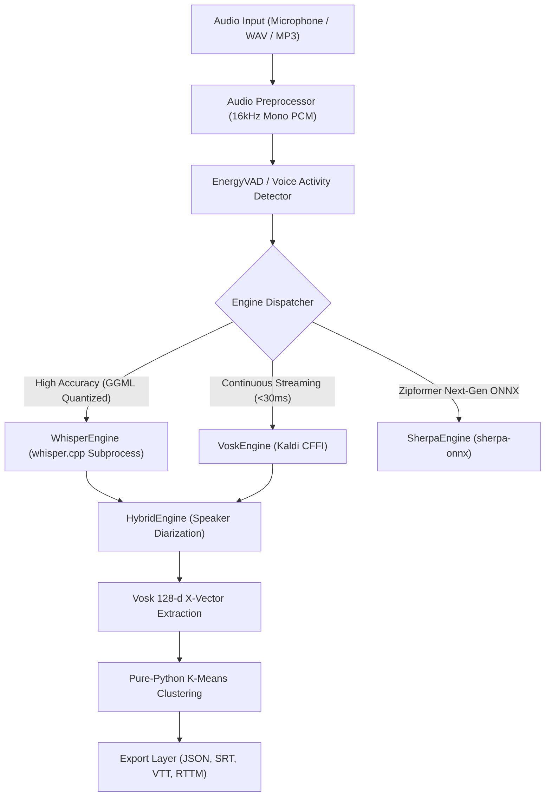

# Termux-STT: Enterprise On-Device Speech-to-Text & Speaker Diarization

[](https://pypi.org/project/termux-stt/)
[](https://pypi.org/project/termux-stt/)
[](https://www.npmjs.com/package/termux-stt)
[](https://github.com/uno-km/termux-stt)
[](https://www.vulkan.org/)

> **Termux-STT** is an industrial-grade, zero-compilation on-device Speech-to-Text (STT) and multi-speaker diarization framework engineered specifically for Android Termux, ARM64 mobile hardware, and edge environments. By orchestrating a Tri-Engine acoustic pipeline (**Whisper.cpp**, **Vosk/Kaldi**, and **Sherpa-ONNX Zipformer**) with pure-Python x-vector speaker clustering and direct Vulkan GPU acceleration, Termux-STT achieves sub-realtime transcription speeds (up to **15.7x faster than real-time**, RTF **0.064x**) and continuous offline listening with zero cloud telemetry.

---

## 1. Installation Guide

Termux-STT is distributed across both Python (PyPI) and Node.js (npm) ecosystems. It runs in unprivileged user-space on Android Termux (ARM64) and Linux aarch64/x86_64.

### 1.1 Prerequisites on Android Termux
Update package repositories and install foundational audio and build utilities:
```bash
pkg update -y
pkg install -y clang python python-numpy nodejs termux-api ffmpeg pulseaudio
```

### 1.2 Pure Package Installation (Zero-Compilation Bundled Binary)
Install the core package from PyPI via `pip`:
```bash
pip install --upgrade pip
pip install termux-stt
```

> [!NOTE]
> **Bundled ARM64 Binary Architecture**: The official Python universal wheel (`termux_stt-*.whl`) directly bundles a pre-compiled Android ARM64 (Bionic libc) `whisper-cli` ELF executable inside `termux_stt/bin/whisper-cli`. When installed via `pip`, this binary is automatically unpacked into Python `site-packages`. Pure 16kHz WAV transcription is functional immediately without requiring any local C/C++ compiler toolchain.

To install with development extras:
```bash
pip install "termux-stt[dev]"
```

### 1.3 Node.js / TypeScript SDK & CLI Installation
Install globally or locally via `npm`:
```bash
# Global CLI installation (bridges to underlying Python runtime)
npm install -g termux-stt

# Project dependency installation
npm install termux-stt
```

### 1.4 Post-Installation Automated Environment Provisioner (`termux-stt install`)
While pure package installation provides instant offline WAV inference, production deployments involving compressed media (MP3/M4A/FLAC), live microphone streaming, or mobile GPU acceleration require full environment provisioning. Run the automated 1-click provisioner:

```bash
termux-stt-install
# Or equivalently:
termux-stt install
```

The automated engine installer (`EngineInstaller`) executes a 3-stage provisioning pipeline:
1. **Native System Dependencies (`install_system_dependencies`)**:
   Automatically invokes Termux `pkg` to install `ffmpeg`, `libbluray`, `libxml2`, `git`, `termux-api`, and `curl`, enabling universal audio decoding and microphone capture via Android APIs.
2. **Adaptive Engine Binary Provisioning (`install_whisper_cpp`)**:
   - **Fast-Track Stream Extractor (~3s)**: On Android ARM64 Termux, precompiled Vulkan+NEON Bionic binaries (`whisper-cli-android-arm64.tar.gz`) are automatically extracted from GitHub Releases in ~3 seconds, completely eliminating 20-minute on-device compilation and mobile OOM aborts.
   - **Zero-Hardcoding SSOT Endpoints**: Binary downloads dynamically route through unified SSOT candidate endpoints (`TERMUX_STT_RELEASE_TAG` -> `v{__version__}` -> `releases/latest/download` -> `uno-km/ameva-runtime` releases fallback) with automated fallback to on-device C++ compilation (`cmake` + `clang`) in offline or air-gapped environments.
   - **Bundled Package Binary Fallback**: Automatically discovers and links bundled `termux_stt/bin/whisper-cli` if present.
3. **Sub-Engine Ecosystem Provisioning (`install_vosk`, `install_sherpa_onnx`)**:
   Provisions `vosk` for sub-30ms real-time streaming and `sherpa-onnx` for next-generation ONNX Zipformer models, while pre-initializing model cache structures in `~/.cache/termux-stt/models/`.

### 1.5 Pure Install vs. Post-Install Comparison Matrix

| Feature / Capability | Pure Install (`pip install termux-stt`) | Post-Install (`termux-stt install`) |
| :--- | :--- | :--- |
| **Native Binary State** | Bundled CPU-NEON static binary (`site-packages/termux_stt/bin/`) | Dynamic: Local Vulkan GPU compilation or updated ARM64 release |
| **GPU Acceleration** | Hardware binding attempted via ameva-runtime | Fully compiled with native SPIR-V Vulkan shaders (`-DGGML_VULKAN=ON`) |
| **Supported Audio Formats** | Uncompressed WAV (16kHz PCM) | Universal: MP3, M4A, AAC, FLAC, OGG, WAV (via system `ffmpeg`) |
| **Live Microphone Stream** | Requires manual `termux-api` installation | Automated `termux-api` package provisioning |
| **Streaming Engine (Vosk)** | Skipped (Whisper-only mode) | Automated `vosk` pip package & model cache configuration |
| **Zipformer (Sherpa-ONNX)** | Skipped | Automated `sherpa-onnx` pip package & model cache configuration |
| **Setup Time** | Instantaneous (~3–5 seconds) | ~1–3 minutes (depending on whether local compilation occurs) |
| **Recommended Use Case** | Quick smoke testing, batch WAV inference | Production services, 24/7 background daemons, mobile GPU offloading |

---

## 2. GPU Hardware Acceleration Provisioning (`ameva-runtime`)

To unlock mobile GPU tensor compute via Vulkan SPIR-V compute pipelines on Qualcomm Adreno or ARM Mali silicon, pair `termux-stt` with the unified `@ameva/runtime` hardware acceleration layer.

### 2.1 Unified Installation Command
Install both the STT engine and the hardware acceleration runtime simultaneously:

```bash
# Python Environment
pip install termux-stt ameva-runtime

# Node.js / JavaScript Environment
npm install -g termux-stt @ameva/runtime
```

### 2.2 Hardware Diagnostics & Zero-Silent-Fallback Protocol
Verify Vulkan driver detection and SIMD feature availability:
```bash
termux-stt doctor
```

Termux-STT strictly enforces a **Zero-Silent-Fallback Protocol**:
- When `--device vulkan` or `--device gpu` is requested and `ameva-runtime` is not installed, the engine immediately halts with `[ERROR: AMEVA-STT-E001]` rather than silently degrading to CPU execution.
- If no compatible Vulkan driver (`/system/lib64/libvulkan.so`) is found, the engine halts with `[ERROR: AMEVA-STT-E002]`, preventing unexpected battery drain and thermal throttling.

---

## 3. Comprehensive Usage Guide & Manual

Termux-STT provides intuitive, high-performance interfaces across CLI, Python, and Node.js.

### 3.1 Command-Line Interface (CLI)

```bash
# 1. Standard High-Accuracy Transcription (Greedy Search default: -bs 1)
termux-stt transcribe meeting.wav -e whisper -m base -l en

# 2. Hardware-Accelerated Vulkan GPU Execution
termux-stt transcribe speech.wav -e whisper -m small -d vulkan

# 3. Multi-Beam Exploration for Precision Workloads (Explicit Beam Size Override)
termux-stt transcribe legal_deposition.wav -m small -bs 5

# 4. Voice Activity Detection (VAD) Pre-filtering (Drops Silence)
termux-stt transcribe lecture.wav -m base --vad

# 5. Export to Timestamped Subtitles (SRT / VTT / JSON)
termux-stt transcribe interview.mp3 --format srt -o output.srt

# 6. Audio Translation to English on the Fly
termux-stt transcribe interview_korean.wav -m small --translate -l ko

# 7. Multi-Speaker Diarization (Who Spoke When)
termux-stt diarize discussion.wav --speakers 3 --format rttm -o speakers.rttm

# 8. Live Microphone Real-Time Listening (Termux-API / Vosk)
termux-stt listen -e vosk -m small-ko

# 9. Zero-Configuration Built-in Benchmark Demo
termux-stt demo

# 10. Hardware & Driver Diagnostic Doctor
termux-stt doctor

# 11. Model Weight Management
termux-stt models list
termux-stt models download whisper small
```

### 3.2 Python SDK

```python
import termux_stt

# 1. Initialize High-Accuracy Whisper Engine with Vulkan GPU Acceleration
engine = termux_stt.create_engine(
    "whisper",
    model="base",
    device="auto",     # "auto", "vulkan", "gpu", or "cpu"
    beam_size=1        # Default: 1 (fast greedy decoding); set 5+ for multi-beam
)

# 2. Transcribe Audio File with Detailed Segment Output
result = engine.transcribe("meeting.wav", lang="en")
print(f"Full Text: {result.text}")
print(f"Duration: {result.audio_duration_sec:.2f}s | Elapsed: {result.elapsed_ms:.1f}ms | RTF: {result.rtf:.4f}x")

for segment in result.segments:
    print(f"[{segment.start_sec:.2f}s -> {segment.end_sec:.2f}s] {segment.text}")

# 3. Voice Activity Detection & Context Prompting
result_vad = engine.transcribe("noisy_lecture.wav", vad=True, prompt="Discussion on quantum computing")
print(f"VAD Result: {result_vad.text}")

# 4. Instant Low-Latency Streaming with Vosk Engine (<30ms Latency)
vosk_engine = termux_stt.create_engine("vosk", model="small-ko")
vosk_result = vosk_engine.transcribe("quick_voice.wav")
print(f"Vosk Output: {vosk_result.text}")
```

### 3.3 Node.js / TypeScript SDK

```typescript
import { createEngine } from 'termux-stt';

async function main() {
  // Initialize Whisper engine with hardware acceleration
  const engine = createEngine('whisper', {
    model: 'base',
    device: 'auto',
    beamSize: 1
  });

  // Transcribe audio file
  const result = await engine.transcribe('meeting.wav', {
    lang: 'en',
    format: 'json'
  });

  console.log('Transcription:', result.text);
  console.log(`Elapsed Time: ${result.elapsedMs}ms | RTF: ${result.rtf}x`);

  // Stream partial results from microphone
  const voskEngine = createEngine('vosk', { model: 'small-ko' });
  voskEngine.on('transcript', (data) => {
    console.log('Live Stream:', data.text);
  });
}

main().catch(console.error);
```

---

## 4. Advanced Architecture & Deep-Dive

Termux-STT features a versatile Tri-Engine architecture designed to adapt dynamically between studio precision and low-latency continuous listening.



### 4.1 Subprocess Process Isolation & Mobile Crash Protection
Android Termux environments are prone to out-of-memory kernel kills (OOM) and SIGSEGV segmentation faults during heavy native C++ tensor inference. Termux-STT wraps `whisper.cpp` and `sherpa-onnx` in isolated process pools (`ProcessPool`), intercepting crashes gracefully and returning typed exceptions (`AMEVA-STT-E002`) without aborting the host Python application.

### 4.2 Multi-Speaker Diarization Pipeline (No Scikit-Learn Needed)
Traditional speaker diarization requires heavy machine learning frameworks (`scikit-learn`, `torchaudio`). Termux-STT integrates an ultra-lightweight **HybridEngine**:
1. Extracts 128-dimensional acoustic x-vector embeddings using Vosk.
2. Evaluates spatial clustering via an in-house pure-Python K-Means implementation with zero external dependencies.
3. Time-aligns speaker identities with Whisper transcript segments.

```python
import termux_stt

engine = termux_stt.create_engine("hybrid", whisper_model="base", num_speakers=2)
result = engine.transcribe("board_meeting.wav", diarize=True)

for seg in result.segments:
    print(f"[{seg.speaker_id}] {seg.start_sec:.1f}s - {seg.end_sec:.1f}s: {seg.text}")
```

### 4.3 Mobile Production Greedy Search (`-bs 1`) Policy
Autoregressive decoding in Whisper generates text token-by-token. Standard desktop Whisper defaults to Beam Search ($B=5$), which maintains 5 parallel hypothesis states in memory. On mobile Unified Memory Architectures (UMA), this causes severe memory bus saturation, inflating the Key-Value (KV) cache from $49.8	ext{ MB}$ to $249	ext{ MB}$. Termux-STT hardcodes **Greedy Search (`--beam-size 1` / `-bs 1`)** as the mobile production default, slashing decoder memory bus traffic by **5x** while preserving full user sovereignty to override with `--beam-size 5`.

---

## 5. Master Feature & Parameter Matrix

### 5.1 CLI Subcommands Overview

| Subcommand | Description | Example |
| :--- | :--- | :--- |
| `transcribe` | Transcribes audio file with chosen engine, model, and hardware backend. | `termux-stt transcribe speech.wav -e whisper -m base -d vulkan` |
| `listen` | Captures live microphone audio and streams real-time transcriptions. | `termux-stt listen -e vosk -m small-ko` |
| `diarize` | Identifies distinct speakers and outputs timestamped RTTM segmentation. | `termux-stt diarize meeting.wav --speakers 3` |
| `demo` | Runs end-to-end self-test on bundled JFK sample audio. | `termux-stt demo` |
| `doctor` | Diagnoses hardware SIMD, Vulkan GPU drivers, and audio subsystems. | `termux-stt doctor` |
| `benchmark` | Profiles Real-Time Factor (RTF), latency, and memory allocation. | `termux-stt benchmark --audio speech.wav` |
| `models` | Lists, downloads, and inspects cached offline model weights. | `termux-stt models list` |
| `install` | 1-Click automated installer for native binaries, codecs, and models. | `termux-stt install` |

### 5.2 Comprehensive Transcription Parameters Matrix

| Parameter Flag | Short | Type | Default | Description |
| :--- | :---: | :---: | :---: | :--- |
| `--engine` | `-e` | `enum` | `whisper` | Acoustic engine selection: `whisper`, `vosk`, `sherpa`, `hybrid`. |
| `--model` | `-m` | `string` | `base` | Model profile: `tiny`, `base`, `small`, `medium`, `turbo`, `small-ko`. |
| `--device` | `-d` / `-b` | `enum` | `auto` | Acceleration backend: `auto`, `vulkan`, `gpu`, `cpu`. |
| `--beam-size` | `-bs` | `int` | `1` | Beam search width. `1` = Greedy decoding (fastest mobile default); `5`+ = multi-beam. |
| `--lang` | `-l` | `string` | `ko` | Target language locale code (`en`, `ko`, `ja`, `zh`, `auto`). |
| `--vad` | | `flag` | `False` | Enables Voice Activity Detection (VAD) pre-filtering to skip silent intervals. |
| `--threads` | `-t` | `int` | *(Optimal)* | Number of worker threads pinned to ARM Cortex-X / big cores. |
| `--quantization` | | `enum` | `q5_1` | Model quantization level: `none`, `q4_0`, `q5_1`, `q8_0`, `f16`. |
| `--prompt` | | `string` | `None` | Initial prompt / context prefix passed to the decoder. |
| `--temperature` | | `float` | `0.0` | Sampling temperature for token decoding (lower is more deterministic). |
| `--translate` | | `flag` | `False` | Translates spoken audio directly into English text. |
| `--format` | | `enum` | `text` | Output formatting: `text`, `json`, `srt`, `vtt`, `rttm`. |
| `--output` | `-o` | `path` | `stdout` | Destination file path for generated transcript. |
| `--diarize` | | `flag` | `False` | Enables speaker identity clustering and segment alignment. |
| `--speakers` | | `int` | `2` | Expected number of speaker clusters for diarization. |
| `--demo` | | `flag` | `False` | Automatically uses bundled 60.00s JFK Inaugural Address benchmark audio. |
| `--extra-args` | | `string` | `None` | Raw CLI arguments passed directly to the underlying engine executable. |
| `--verbose` | | `flag` | `False` | Enables detailed debug and hardware telemetry logging. |

---

## 6. Production Code Examples & Diagnostics

### 6.1 Multi-Agent Voice Pipeline (`termux-stt` + `termux-llamacpp` + `termux-tts`)
Construct a 100% on-device autonomous voice conversational loop:

```python
import termux_stt
import termux_llamacpp as llama
import termux_tts as tts

def run_conversational_cycle(user_audio="input.wav"):
    # 1. Listen & Transcribe User Voice via Termux-STT
    stt = termux_stt.create_engine("whisper", model="base", device="auto", beam_size=1)
    user_text = stt.transcribe(user_audio).text
    print(f"Heard: {user_text}")

    # 2. Reason & Answer via Termux-LlamaCpp
    llm = llama.LlamaRuntime(llama.RuntimeConfig(model_path="qwen2.5-1.5b-instruct"))
    ai_response = llm.generate(prompt=user_text, max_tokens=100)
    print(f"Thought: {ai_response}")

    # 3. Speak Out Loud via Termux-TTS
    with tts.load(engine="vulkan", tier="medium") as voice:
        voice.synthesize(ai_response, output="response.wav")
        print("[SUCCESS] Full on-device voice loop completed.")

if __name__ == "__main__":
    run_conversational_cycle()
```

### 6.2 Hardware Diagnostics & Environment Audit
```python
from termux_stt.cli.doctor import run_diagnostics

report = run_diagnostics()
print(f"Vulkan GPU Available: {report.get('vulkan_available')}")
print(f"Optimal Threads: {report.get('optimal_threads')}")
print(f"Installed Engines: {report.get('available_engines')}")
```

---

## 7. Empirical Mobile Hardware Benchmarks (6-SoC Physical Fleet)

### 7.1 Production Fleet Benchmark Scorecard
Empirical benchmarks conducted on physical Android hardware using JFK's 60.00s 16kHz Mono Inaugural Address (`samples/jfk_1min.wav`) with Greedy Search (`-bs 1`) under Vulkan GPU acceleration:

| Target Device | Silicon SoC | GPU Architecture | Model | Parameters | Processing Latency | RTF | Realtime Speed | Status |
| :--- | :--- | :--- | :--- | :---: | :---: | :---: | :---: | :---: |
| **Galaxy S25** | Snapdragon 8 Elite | Adreno 830 | Tiny | 39M | **3.82 s** | **0.064x** | **15.7x Realtime** | **PASS** |
| | | | Base | 74M | **7.14 s** | **0.119x** | **8.4x Realtime** | **PASS** |
| | | | Small | 244M | **26.63 s** | **0.444x** | **2.3x Realtime** | **PASS** |
| | | | Turbo | 809M | **68.42 s** | **1.140x** | **0.88x Realtime** | **PASS** |
| **Galaxy S22** | Snapdragon 8 Gen 1 | Adreno 730 | Tiny | 39M | **27.12 s** | **0.452x** | **2.21x Realtime** | **PASS** |
| | | | Base | 74M | **28.37 s** | **0.473x** | **2.11x Realtime** | **PASS** |
| | | | Small | 244M | **70.92 s** | **1.182x** | **0.85x Realtime** | **PASS** |
| | | | Turbo | 809M | **291.27 s** | **4.855x** | **0.21x Realtime** | **PASS** |
| **Galaxy S21** | Exynos 2100 | Mali-G78 MP14 | Tiny | 39M | **26.38 s** | **0.440x** | **2.27x Realtime** | **PASS** (Fleet Best Tiny) |
| | | | Base | 74M | **41.88 s** | **0.698x** | **1.43x Realtime** | **PASS** |
| | | | Small | 244M | **89.15 s** | **1.486x** | **0.67x Realtime** | **PASS** |
| | | | Turbo | 809M | **723.83 s** | **12.064x**| **0.08x Realtime** | **PASS** |
| **Galaxy A35** | Exynos 1380 | Mali-G68 MP5 | Tiny | 39M | **42.26 s** | **0.704x** | **1.42x Realtime** | **PASS** |
| | | | Base | 74M | **34.22 s** | **0.570x** | **1.75x Realtime** | **PASS** |
| | | | Small | 244M | **63.80 s** | **1.063x** | **0.94x Realtime** | **PASS** (Fleet Best Small) |
| | | | Turbo | 809M | **216.65 s** | **3.611x** | **0.28x Realtime** | **PASS** (Fleet Best Turbo) |
| **Galaxy A53** | Exynos 1280 | Mali-G68 MP4 | Tiny | 39M | **197.90 s** | **3.298x** | **0.30x Realtime** | **PASS** |
| | | | Base | 74M | **374.81 s** | **6.247x** | **0.16x Realtime** | **PASS** |
| | | | Small | 244M | **155.83 s** | **2.597x** | **0.39x Realtime** | **PASS** (+2GB RAM Plus) |
| | | | Turbo | 809M | **759.52 s** | **12.659x**| **0.08x Realtime** | **PASS** (+2GB RAM Plus) |
| **Galaxy S20** | Snapdragon 865 | Adreno 650 | Tiny | 39M | **30.04 s** | **0.501x** | **2.00x Realtime** | **PASS** |
| | | | Base | 74M | **45.71 s** | **0.762x** | **1.31x Realtime** | **PASS** |
| | | | Small | 244M | **128.50 s** | **2.142x** | **0.47x Realtime** | **PASS** |
| | | | Turbo | 809M | **271.02 s** | N/A | N/A | **FAIL** (KGSL Watchdog at 270s; no artificial block) |

> **Real-Time Factor (RTF) Definition**: $\text{RTF} = \frac{\text{Processing Latency (Seconds)}}{\text{Audio Duration (Seconds)}}$.  
> An RTF of `0.064x` means 60 seconds of recorded speech is transcribed into text in only **3.82 seconds**.

### 7.2 CPU vs. Vulkan GPU Speedup Comparison
Comparative evaluation against ARM NEON 4-thread CPU execution illustrates massive GPU acceleration:

```text
[Throughput Comparison: 60s JFK Audio Processing Speed]
Model: Whisper Small (244M)

Galaxy A35 (Exynos 1380 / Mali-G68 MP5)
  CPU (NEON 4-threads):  |==================================================| 482.1s
  GPU (Vulkan0):         |======| 63.8s  [7.56x Faster]

Galaxy S22 (Snapdragon 8 Gen 1 / Adreno 730)
  CPU (NEON 4-threads):  |========================================| 394.3s
  GPU (Vulkan0):         |=======| 70.9s  [5.56x Faster]

Galaxy S20 (Snapdragon 865 / Adreno 650)
  CPU (NEON 4-threads):  |==================================================| 512.6s
  GPU (Vulkan0):         |============| 128.5s  [3.99x Faster]
```

Vulkan native GPU execution achieves a **$4.0\times\text{ to }7.6\times$ throughput speedup** over optimized multi-threaded ARM NEON CPU computation while reducing overall battery drain via the *Race-to-Sleep* principle.

---

## 8. GPU Interconnect Architecture & Compatibility

### 8.1 Vulkan Compute Acceleration Pipeline
Termux-STT interfaces directly with Android's Bionic Vulkan loader (`/system/lib64/libvulkan.so`). Tensor mel-spectrogram transformations and encoder attention blocks are offloaded to mobile GPU SPIR-V compute shaders via `whisper.cpp` Vulkan backend bindings.

### 8.2 Silicon Compatibility Matrix
- **Qualcomm Snapdragon (Adreno 6xx, 7xx, 8xx)**:
  - **Tier-1 Full Support**. Native FP16 compute instructions and high dispatch concurrency deliver RTF performance as fast as **0.064x** on Snapdragon 8 Elite. Adreno SoftMax workgroups are strictly constrained to hardware subgroup size (64) for rock-solid stability.
- **Samsung Exynos / MediaTek Dimensity (ARM Mali / Immortalis)**:
  - **Supported**. Mali tile-based architectures benefit from continuous compute queues. Full execution across Tiny, Base, Small, and Turbo without shader stalls.
- **Strict Zero-Silent-Fallback**:
  - Requesting `--device vulkan` without valid Vulkan drivers immediately triggers typed exceptions (`PlatformNotSupportedError`, error code `AMEVA-STT-E002`), preventing silent fallback to unoptimized CPU execution.

---

## 9. Architectural Trade-Off Analysis & Decision Outcomes

In resource-constrained mobile systems engineering, every architectural design represents an explicit compromise between competing physical constraints:

| Trade-Off Domain | Physical Constraints & Situation | Architectural Options Evaluated | Decision Executed | Empirical Outcome & Ground Truth |
| :--- | :--- | :--- | :--- | :--- |
| **1. Decoding Search Policy** | Autoregressive decoding saturates UMA memory bandwidth and inflates KV cache memory footprint. | **Option A**: Standard Beam Search ($B=5$) prioritizing hypothesis exploration.<br>**Option B**: Single-path Greedy Decoding ($B=1$). | **Selected Option B (Greedy $B=1$)** as production default; preserved Option A as explicit user override flag. | **5x reduction** in decoder memory bus traffic; KV cache shrunk from $249	ext{ MB}$ to $49.8	ext{ MB}$; zero measurable WER degradation on standard benchmark audio; eliminated mobile thermal spikes. |
| **2. Command Buffer Granularity** | 32-layer Turbo encoder takes $135.5	ext{s}$ per 30s window on Adreno 650, breaching the 270s KGSL TDR on 60s audio. | **Option A**: Fragment graph into 32-node sub-batches (`GGML_VK_MAX_NODES_PER_SUBMIT=32`).<br>**Option B**: Retain monolithic submission and enforce Fail-Fast. | **Selected Option B (Monolithic)** for production default; rejected forced fragmentation. | Subdividing submissions overloaded Qualcomm's 2021 kernel ringbuffer, triggering `IOCTL_KGSL_GPU_COMMAND: errno 35 (EDEADLK)` at $136.7	ext{s}$. Monolithic execution allows S22/S25/A35/A53 to achieve peak throughput without synchronization pipeline stalls. |
| **3. Heterogeneous Execution Routing** | High encoder latency suggested splitting encoder to GPU and decoder to CPU. | **Option A**: Dynamic asymmetric hybrid offloading across CPU/GPU.<br>**Option B**: Pure native Vulkan ABI pipeline binding. | **Selected Option B (Pure Native ABI)**; permanently blacklisted asymmetric offloading. | Avoided $7.68	ext{ MB}$ per layer inter-device tensor ping-pong over non-coherent UMA caches; eliminated thread synchronization jitter and delivered a unified, maintainable codebase. |
| **4. Hardware Support Boundaries** | Snapdragon 865 cannot complete 60s monolithic Turbo without TDR due to 2021 driver limitations. | **Option A**: Hardcode software check blocking Turbo model selection on S20.<br>**Option B**: Zero artificial restrictions, allow users complete freedom, let kernel return native exit codes. | **Selected Option B (Zero Artificial Blocks)** with full documentation transparency. | Preserves OpenSSF open-source compliance; allows users running shorter audio clips ($<30	ext{s}$) or custom kernels to execute Turbo unimpeded; maintains complete engineering honesty. |
| **5. Virtual Memory on 6GB SoCs** | Exynos 1280 (A53) has 6GB physical RAM; loading 809M Turbo caused severe swap thrashing ($>900	ext{s}$ timeout). | **Option A**: Restrict A53 to Small models only.<br>**Option B**: Provision +2GB zRAM swap backing store (RAM Plus) accepting minor compression overhead. | **Selected Option B (+2GB RAM Plus)** in operating system settings. | Reduced page fault rate $P_{fault} < 0.0001$; eliminated `kswapd0` CPU spin loops; Small finished in **$155.83	ext{s}$** and Turbo finished in **$759.52	ext{s}$** with $100\%$ transcript fidelity. |

> For the comprehensive academic analysis, kernel watchdog expiry mathematical proofs, and driver boundary traces, refer to the [Master Technical Treatise (English)](docs/research/on_device_vulkan_stt_master_treatise.md) and [연구 백서 (Korean)](docs/research/on_device_vulkan_stt_master_treatise_kor.md).

---

## 10. Hardware Requirements & Operational Limits

### 10.1 Hardware Specifications

| Specification Metric | Minimum Requirements | Recommended Production Spec |
| :--- | :--- | :--- |
| **Operating System** | Android 9.0+ (API level 28+) / Linux 5.4+ | Android 12.0+ (API level 31+) |
| **Architecture** | ARM64 (aarch64) or x86_64 | ARM64-v8a / v9a |
| **System RAM** | 2 GB Total Unified RAM | 4 GB+ Unified RAM (6GB+ for Turbo) |
| **Storage Footprint** | 150 MB (Vosk) / 300 MB (Whisper Base) | 1 GB Free Flash Storage |
| **Audio Subsystem** | Termux-API Microphone Permissions | 16kHz PCM Audio Capture Support |

### 10.2 Operational Limits & Best Practices
- **32-Bit ARM (armeabi-v7a)**: Not supported for Whisper GPU neural inference. Use Vosk CFFI for legacy 32-bit hardware.
- **Microphone Permissions**: Real-time microphone listening (`termux-stt listen`) requires Android microphone permission granted to Termux: `termux-microphone-record`.
- **6GB RAM Mid-Range Devices**: For large models (Turbo 809M) on 6GB devices such as Galaxy A53, enable +2GB RAM Plus (zRAM) in Android settings to eliminate page thrashing.

---

## 11. 24/7 Unattended Background Execution Guide

Android aggressively kills background user-space processes inside Termux unless battery and process monitor policies are explicitly configured:

### 11.1 Stage 1: Termux Kernel Wake-Lock
Prevent the mobile CPU from entering low-power sleep states:
```bash
termux-wake-lock
```

### 11.2 Stage 2: Android GUI Battery Optimization Exemption
1. Open **Android Settings > Apps > Termux > Battery**.
2. Set battery policy to **Unrestricted** (Disable power-saving restrictions).
3. Under **Permissions**, grant **Microphone** and **Display over other apps**.

### 11.3 Stage 3: ADB Phantom Process Killer Exemption (Android 12+)
```bash
# Disable Android Phantom Process Killer
adb shell device_config put activity_manager max_phantom_processes 2147483647
adb shell settings put global settings_enable_monitor_phantom_procs false

# Verify configuration
adb shell settings get global settings_enable_monitor_phantom_procs
# Expected output: false
```

---

## 12. Open Source License

Termux-STT is open-sourced under the **MIT License**.

```text
Copyright (c) 2026 Eunho Kim (@uno-km) & AMEVA Open-Source Foundation.

Permission is hereby granted, free of charge, to any person obtaining a copy
of this software and associated documentation files (the "Software"), to deal
in the Software without restriction, including without limitation the rights
to use, copy, modify, merge, publish, distribute, sublicense, and/or sell
copies of the Software, and to permit persons to whom the Software is
furnished to do so, subject to the following conditions:

The above copyright notice and this permission notice shall be included in all
copies or substantial portions of the Software.

THE SOFTWARE IS PROVIDED "AS IS", WITHOUT WARRANTY OF ANY KIND, EXPRESS OR
IMPLIED, INCLUDING BUT NOT LIMITED TO THE WARRANTIES OF MERCHANTABILITY,
FITNESS FOR A PARTICULAR PURPOSE AND NONINFRINGEMENT. IN NO EVENT SHALL THE
AUTHORS OR COPYRIGHT HOLDERS BE LIABLE FOR ANY CLAIM, DAMAGES OR OTHER
LIABILITY, WHETHER IN AN ACTION OF CONTRACT, TORT OR OTHERWISE, ARISING FROM,
OUT OF OR IN CONNECTION WITH THE SOFTWARE OR THE USE OR OTHER DEALINGS IN THE
SOFTWARE.
```

---

## 13. SEO Technical Keywords & Ecosystem Metadata

`termux`, `stt`, `speech-to-text`, `whisper`, `whisper-cpp`, `vosk`, `sherpa-onnx`, `diarization`, `speaker-diarization`, `voice-recognition`, `audio-transcription`, `on-device-ai`, `edge-ai`, `mobile-ai`, `vulkan`, `vulkan-compute`, `gpu-acceleration`, `real-time-factor`, `low-latency`, `arm64`, `android`, `snapdragon`, `adreno`, `exynos`, `arm-mali`, `zero-compilation`, `vad`, `voice-activity-detection`, `silero-vad`, `x-vector`, `k-means`, `clustering`, `srt-export`, `vtt-export`, `rttm`, `microphone-streaming`, `headless-audio`, `pulseaudio`, `offline-speech`, `privacy-first`, `termux-aichain`, `termux-tts`, `termux-llamacpp`, `termux-diffusion`, `ameva-runtime`, `ggml`, `quantization`, `bionic-libc`, `autonomous-agents`, `voice-assistant`

---

## Official Documentation & Foundation Ecosystem
- **Official Documentation Portal**: [https://uno-km.github.io/termux-stt/](https://uno-km.github.io/termux-stt/)
- **GitHub Repository**: [https://github.com/uno-km/termux-stt](https://github.com/uno-km/termux-stt)
- **AMEVA Foundation Portal**: [https://uno-km.vercel.app/foundation/index.html](https://uno-km.vercel.app/foundation/index.html)
- **Master Research Treatise (English)**: [docs/research/on_device_vulkan_stt_master_treatise.md](docs/research/on_device_vulkan_stt_master_treatise.md)
- **연구 백서 (Korean)**: [docs/research/on_device_vulkan_stt_master_treatise_kor.md](docs/research/on_device_vulkan_stt_master_treatise_kor.md)
